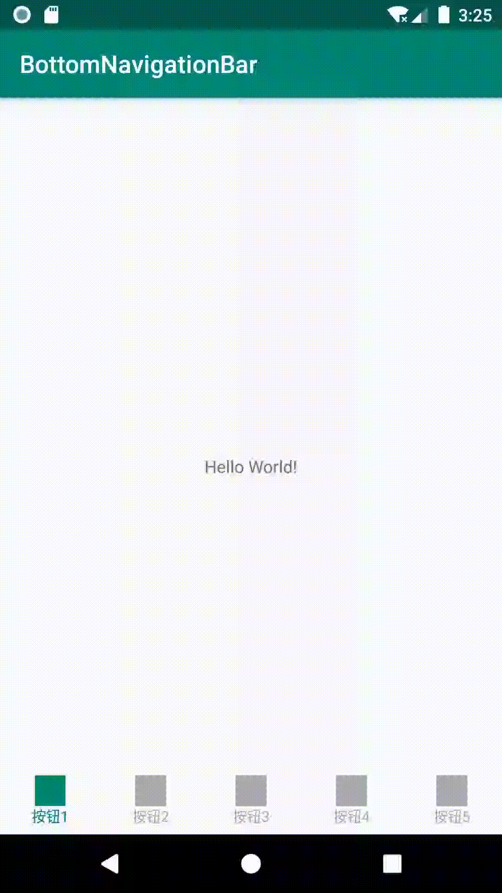

# BottomNavigationBar--底部NavigationBar

### 效果图：  
 

### 使用：   

layout:

```xml
<?xml version="1.0" encoding="utf-8"?>
<android.support.constraint.ConstraintLayout xmlns:android="http://schemas.android.com/apk/res/android"
    xmlns:app="http://schemas.android.com/apk/res-auto"
    xmlns:tools="http://schemas.android.com/tools"
    android:layout_width="match_parent"
    android:layout_height="match_parent"
    tools:context=".MainActivity">

    <com.yu.hu.bottomnavigationbar.BottomNavigationBar
        android:id="@+id/bnb"
        android:layout_width="match_parent"
        android:layout_height="55dp"
        app:layout_constraintBottom_toBottomOf="parent"
        app:layout_constraintEnd_toEndOf="parent"
        app:layout_constraintStart_toStartOf="parent" />

</android.support.constraint.ConstraintLayout>
```

 java:

```java
public class MainActivity extends AppCompatActivity {

    @Override
    protected void onCreate(Bundle savedInstanceState) {
        super.onCreate(savedInstanceState);
        setContentView(R.layout.activity_main);


        BottomNavigationBar bottomNavigationBar = findViewById(R.id.bnb);

        //添加模拟数据
        for (int i = 1; i <= 5; i++) {
            BottomItem item = new BottomItem();
            //文字
            item.setText("按钮" + i);
            //设置按钮图片资源文件
            item.setIconDrawable(getResources().getDrawable(R.drawable.ic_launcher_background, null));
            bottomNavigationBar.addItem(item);

        }

        //选中事件
        bottomNavigationBar.addOnSelectedListener(new BottomNavigationBar.OnSelectedListener() {
            @Override
            public void OnSelected(int oldPosition, int newPosition) {
                Toast.makeText(MainActivity.this, "选中了" + newPosition + ", 之前是" + oldPosition, Toast.LENGTH_SHORT).show();
            }
        });

        bottomNavigationBar.initialize();
    }
}
```

